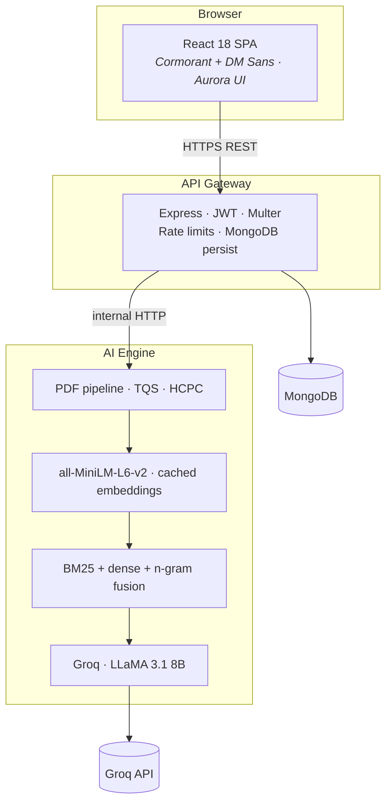

<p align="center">
  <br />
  <span style="font-size: 4rem; font-family: serif;">نور</span>
  <br /><br />
  <em>Light on the path. Knowledge rooted in your world.</em>
  <br /><br />
  <strong>AI curriculum gap detection & culturally grounded learning<br />for India's 250 million state-board students.</strong>
</p>

<p align="center">
  <a href="https://python.org"></a>
  <a href="https://fastapi.tiangolo.com"></a>
  <a href="https://react.dev"></a>
  <a href="https://nodejs.org"></a>
  <a href="https://mongodb.com"></a>
  <a href="LICENSE"></a>
</p>

<p align="center">
  <a href="#quick-start">Quick Start</a> ·
  <a href="#architecture">Architecture</a> ·
  <a href="#modules">Modules</a> ·
  <a href="#api">API</a> ·
  <a href="#deployment">Deployment</a> ·
  <a href="#troubleshooting">Troubleshooting</a>
</p>

---

## ✦ The problem

India has **250 million** school students on state boards. When they aim for NEET, JEE, or CUET, two invisible taxes stack against them:

| Tax | What it is | What Noor does |
|-----|------------|----------------|
| **Curriculum gap** | State syllabi under-cover topics national exams test | Finds every missing topic, ranked by exam impact |
| **Cognitive context** | Textbook examples use unfamiliar urban/northern contexts | Rewrites problems in the student's own geography, language, and culture |

Noor eliminates both — **before exam day**, in a language their world already speaks.

---

## ✦ Architecture



<details>
<summary><strong>ASCII overview</strong></summary>

```
┌──────────────┐     HTTPS      ┌─────────────────┐     HTTP      ┌──────────────────┐
│  React SPA   │ ─────────────► │ Express Gateway │ ────────────► │ FastAPI AI Engine │
│  JWT client  │                │ Auth · Upload   │               │ PDF · Embed · LLM │
└──────────────┘                └────────┬────────┘               └──────────────────┘
                                         │
                                         ▼
                                  ┌─────────────┐
                                  │  MongoDB    │
                                  └─────────────┘
```

</details>

### Stack at a glance

| Layer | Technology | Role |
|-------|------------|------|
| Frontend | React 18, React Router, Axios | Ethereal dark UI, gap reports, hyperlocal studio |
| Gateway | Node 18, Express, Mongoose | Auth, validation, AI proxy, history |
| AI Engine | Python 3.10, FastAPI, sentence-transformers | PDF → gaps → study modules → localisation |
| LLM | Groq (`llama-3.1-8b-instant`) | Study modules & culturally grounded rewrites |
| Data | MongoDB | Users, gap reports, hyperlocal history |
| Ops | Docker Compose | One-command full stack |

---

## ✦ Modules

### 01 · Curriculum Gap Finder

Upload a state-board syllabus PDF. Noor compares it against national exam syllabi using **three fused signals**:

| Signal | Weight | Captures |
|--------|--------|----------|
| Dense semantic (MiniLM) | 0.55 | Same concept, different wording |
| BM25 lexical | 0.25 | IUPAC names, theorem titles, exact nomenclature |
| Bigram Jaccard | 0.20 | Spelling variants, compound terms |

Fusion uses a **weighted harmonic mean** so all three must agree before a topic is marked covered.

| Priority | Fused score | Typical impact |
|----------|-------------|----------------|
| CRITICAL | &lt; 0.40 | ~6–9 marks / exam |
| HIGH | 0.40 – 0.55 | ~3–5 marks |
| MEDIUM | 0.55 – 0.62 | ~1–2 marks |

**Supported exam / subject pairs:** NEET (Chemistry, Physics, Biology) · JEE Mains (Mathematics, Chemistry, Physics) · CUET (Chemistry)

### 02 · Hyperlocal Content Generator

Paste any textbook problem. Choose one of **six curated regions** — Rajasthan, Kerala, Punjab, West Bengal, Tamil Nadu, Andhra Pradesh. Noor rewrites using real occupations, routes, foods, and units from that region, then validates **mathematical invariance** (numbers preserved).

---

## ✦ Quick start

### Prerequisites

| Tool | Version | Notes |
|------|---------|-------|
| Node.js | 18+ | Backend + frontend |
| Python | 3.10+ | AI engine |
| MongoDB | Atlas or local | Free M0 tier works |
| Groq API key | — | [console.groq.com](https://console.groq.com) |

### 1 · Clone & configure

```bash
git clone <your-repo-url>
cd noor
```

Copy environment templates:

| File | Purpose |
|------|---------|
| `ai-engine/.env` | `GROQ_API_KEY=gsk_...` |
| `backend/.env` | `MONGO_URI`, `JWT_SECRET`, `AI_ENGINE_URL`, `FRONTEND_URL` |
| `frontend/.env` | `REACT_APP_API_URL=http://localhost:5000` |

Generate a strong JWT secret:

```bash
node -e "console.log(require('crypto').randomBytes(64).toString('hex'))"
```

### 2 · Install

```bash
cd backend && npm install && cd ..
cd frontend && npm install && cd ..
cd ai-engine
python -m venv venv
# Windows: venv\Scripts\activate
# macOS/Linux: source venv/bin/activate
pip install -r requirements.txt
cd ..
```

### 3 · Pre-compute embeddings (once — before first demo)

```bash
cd ai-engine
source venv/bin/activate   # or venv\Scripts\activate on Windows
python scripts/precompute_embeddings.py
```

Downloads `all-MiniLM-L6-v2` (~80 MB) and caches all national syllabi. Subsequent analyses skip national embedding work.

### 4 · Run

Three terminals:

```bash
# AI Engine
cd ai-engine && uvicorn main:app --reload --port 8000

# Backend
cd backend && npm run dev

# Frontend
cd frontend && npm start
```

Open **[http://localhost:3000](http://localhost:3000)**

### Docker

```bash
docker-compose up --build
```

| Service | URL |
|---------|-----|
| Frontend | http://localhost:3000 |
| Backend | http://localhost:5000 |
| AI Engine | http://localhost:8000 |

Set `backend/.env` for Docker: `AI_ENGINE_URL=http://ai-engine:8000`, `MONGO_URI=mongodb://mongo:27017/noor`

---

## ✦ API

<details>
<summary><strong>Authentication</strong></summary>

| Method | Endpoint | Auth | Body |
|--------|----------|------|------|
| `POST` | `/api/auth/register` | — | `{ name, email, password, class, stateBoard, district, targetExam? }` |
| `POST` | `/api/auth/login` | — | `{ email, password }` |
| `GET` | `/api/auth/me` | JWT | — |

</details>

<details>
<summary><strong>Gap Finder</strong></summary>

| Method | Endpoint | Auth | Notes |
|--------|----------|------|-------|
| `POST` | `/api/gap/analyse` | JWT | `multipart`: `syllabus` (PDF), `board`, `exam`, `subject` |
| `GET` | `/api/gap/reports` | JWT | `?page=1&limit=10` |
| `GET` | `/api/gap/reports/:id` | JWT | Full report with study modules |
| `DELETE` | `/api/gap/reports/:id` | JWT | GDPR delete |

</details>

<details>
<summary><strong>Hyperlocal</strong></summary>

| Method | Endpoint | Auth | Notes |
|--------|----------|------|-------|
| `POST` | `/api/hyperlocal/generate` | JWT | Single region rewrite |
| `POST` | `/api/hyperlocal/generate/batch` | JWT | Up to 6 regions |
| `GET` | `/api/hyperlocal/regions` | — | Region metadata |
| `GET` | `/api/hyperlocal/history` | JWT | User history |

</details>

---

## ✦ Deployment

### Pre-ship checklist

- [ ] Set `GROQ_API_KEY`, `JWT_SECRET` (64+ chars), production `MONGO_URI`
- [ ] Run `python scripts/precompute_embeddings.py` (or mount warmed `ai_embeddings` volume)
- [ ] Set `FRONTEND_URL` to your production origin (CORS)
- [ ] Build frontend with correct `REACT_APP_API_URL` (baked at build time)
- [ ] Whitelist server IP on MongoDB Atlas
- [ ] Confirm `/health` on backend and AI engine respond 200

### Performance (typical laptop CPU)

| Operation | Cold | Warm |
|-----------|------|------|
| PDF extraction (20 pp) | 1–2 s | 1–2 s |
| National syllabus embed | 5–8 s | **0 s** (cache) |
| Gap detection | ~0.3 s | ~0.3 s |
| Study modules (5 CRITICAL) | 12–18 s | 12–18 s |
| **End-to-end gap analysis** | **25–40 s** | **20–25 s** |
| Hyperlocal rewrite | 6–10 s | 6–10 s |

---

## ✦ Project structure

```
noor/
├── ai-engine/          # FastAPI · PDF · embeddings · gap · hyperlocal
├── backend/            # Express · JWT · MongoDB · AI proxy
├── frontend/           # React SPA · aurora design system
├── docker-compose.yml
└── README.md
```

---

## ✦ Design

Noor's UI is **dawn light** — the breath before sunrise when peach, rose, lavender, and sky still share the sky.

| Token | Hex | Mood |
|-------|-----|------|
| Peach | `#FFD4B8` | Morning warmth |
| Rose | `#FFB5C8` | First blush |
| Lavender | `#D4B8FF` | Pre-dawn violet |
| Deep | `#1A0F2E` | Night canvas |

**Cormorant Garamond** for display · **DM Sans** for UI · living aurora background · glass surfaces · scroll-aware navbar.

---

## ✦ Troubleshooting

| Symptom | Fix |
|---------|-----|
| `GROQ_API_KEY` validation error | Add key to `ai-engine/.env` |
| MongoDB connection failed | Check URI; whitelist IP on Atlas |
| PDF quality too low | Use text-based PDF (not scanned image) |
| 0 gaps found | Check AI logs for TQS; try re-exporting PDF |
| CORS error | Match `FRONTEND_URL` in `backend/.env` to browser origin |
| AI engine not reachable | Start `uvicorn main:app --port 8000` |
| Slow first request | Run embedding precompute script first |
| Docker backend unhealthy | Healthcheck uses `GET /health` (no JWT required) |

---

## ✦ References

Porter (2002) · Webb (2007) · Reimers & Gurevych (2019) · Robertson & Zaragoza (2009) · Sweller (1988) · Vygotsky (1978) · Ladson-Billings (1995) · ASER (2023) · NTA syllabi (2024)

---

<p align="center">
  <br />
  <strong>نور</strong>
  <br /><br />
  <em>Every child deserves a light on their path.</em>
  <br /><br />
  The 2.68 crore students who sit NEET every year deserve to know what they don't know —
  <br />and to learn it in a language their world already speaks.
  <br /><br />
</p>
